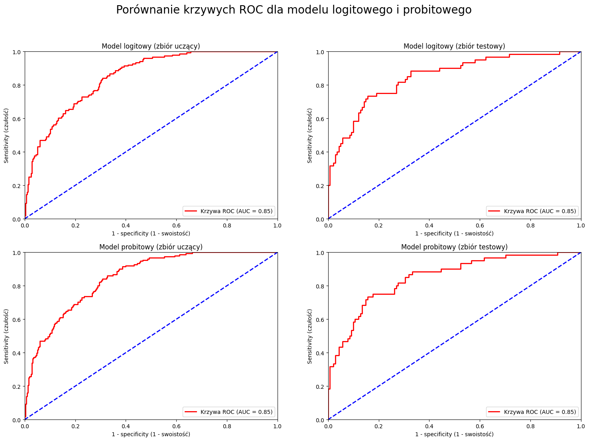

## Opis projektu

Zbiór danych, zawiera informacje na temat 768 pacjentów. Są to rdzenne mieszkanki Ameryki Północnej (*Pima Indians*), kobiety w wieku od 21 wzywż.
Celem projektu jest budowa i ocena modeli objasniających ryzyko wystąpienia cukrzycy u pacjentów na podstawie 8 następujących predyktorów:

### Predyktory

* *Pregnancies* - liczba przebytych ciąż
* *Glucose* - stężenie glukozy w osoczu po 2 godzinach od doustnego testu obciążenia glukozą (OGTT)
* *BloodPressure* - ciśnienie krwi (mm Hg)
* *SkinThickness* -  grubość fałdu skórnego na tricepsie (w milimetrach)
* *Insulin* - poziom insuliny po 2 godzinach od podania glukozy (mu U/ml)
* *BMI* - wskaźnik masy ciała (kg/m^2)
* *DiabetesPedigreeFunction* - wartość oceniająca prawdopodobieństwo wystąpienia cukrzycy na podstawie historii rodziny
* *Age* - wiek pacjenta w latach

### Zmienna objaśniana

* *Outcome* - 1: pacjent chory na cukrzycę, 0: pacjent zdrowy

W zbiorze danych znajduje się 268 pacjentów ze stwierdzoną cukrzycą, oraz 500 pacjentów bez cukrzycy.

W projekcie nie uwzględnono analizy interakcji między zmiennymi. W przyszłości należałoby ją wykonać, aby lepiej zrozumieć jak poszczególne interakcje wpływają na ryzyko wystąpienia cukrzycy.

### Wyniki

#### Interpretacja modelu logitowego

1. Zmiana Pregnancies o jedną jednostkę powoduje wzrost szansy na wystąpienie cukrzycy o 12.1%, *ceteris paribus*.
2. Zmiana Glucose o jedną jednostkę powoduje wzrost szansy na wystąpienie cukrzycy o 4.02%, *ceteris paribus*.
3. Zmiana BMI o jedną jednostkę powoduje wzrost szansy na wystąpienie cukrzycy o 8.52%, *ceteris paribus*.
4. Zmiana DiabetesPedigreeFunction o jedną jednostkę powoduje wzrost szansy na wystąpienie cukrzycy o 174.89%, *ceteris paribus*.
5. Zmiana Age o jedną jednostkę powoduje wzrost szansy na wystąpienie cukrzycy o 2.58%, *ceteris paribus*.

### Źródła
* [Dane użyte do analizy](https://www.kaggle.com/datasets/uciml/pima-indians-diabetes-database)
* https://stackoverflow.com/questions/22428625/does-statsmodels-or-another-python-package-offer-an-equivalent-to-rs-step-f
* https://scikit-learn.org/0.21/user_guide.html
* https://www.statology.org/likelihood-ratio-test-in-python/
* https://www.geeksforgeeks.org/qqplot-quantile-quantile-plot-in-python/
* https://www.statsmodels.org/stable/user-guide.html